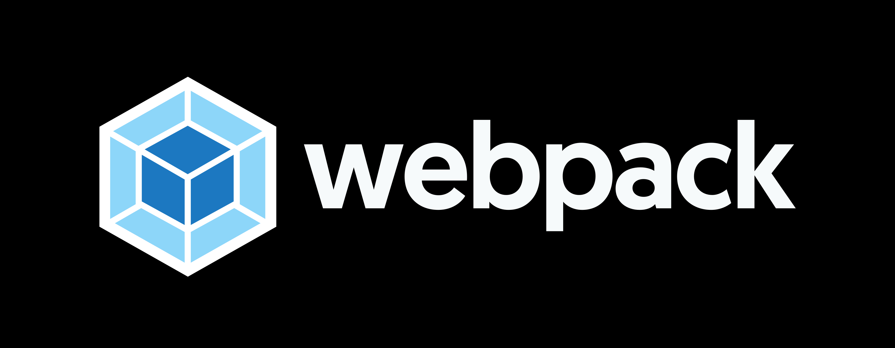

<div align="center">
<h1>React Webpack Boilerplate</h1>

</div>

## Functionalities

-   [x] Build React App without interacting with the CLI
-   [x] Live Hot Reload

## INSTALLATION

```
git clone https://github.com/gulraiznoorbari/React-Webpack-Boilerplate.git
cd React-webpack-boilerplate
npm install
npm start
```

## For Production

```
npm build
```

## Author

You can get in touch with me on my LinkedIn Profile:

#### Gulraiz Noor Bari

[](https://www.linkedin.com/in/gulraiznoorbari)
<br />
[](https://twitter.com/gulraiznoorbari)

You can also follow my GitHub Profile to stay updated about my latest projects: [](https://github.com/gulraiznoorbari)

If you liked the repo then kindly support it by giving it a star ⭐!

## Contributions Welcome

[](#)

If you find any bug in the code or have any improvements in mind then feel free to generate a pull request.
